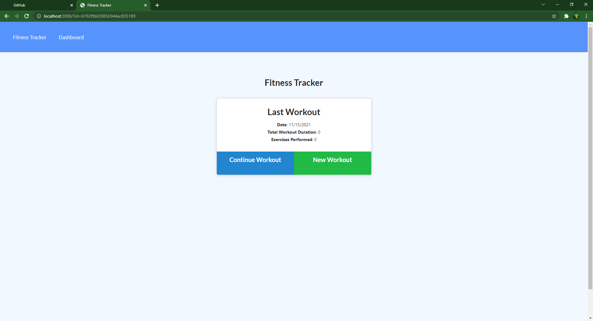
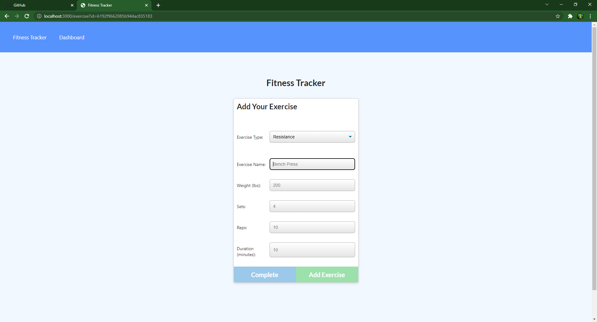
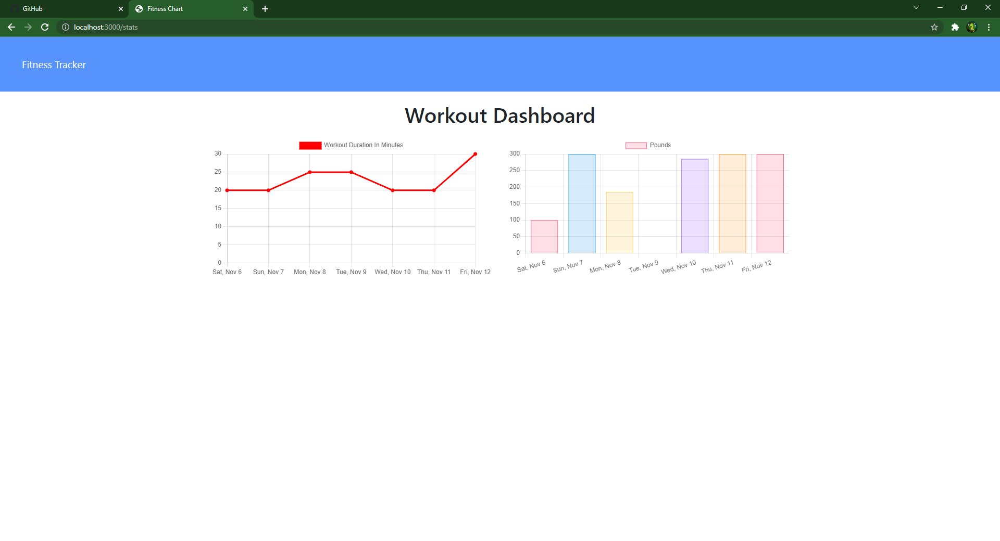

# hw18-Workout-Tracker

## Description

This application should be used to track your workouts. On the main page you will be shown stats about your current or last workout. You can click to add a workout with the button and be prompted with another page that will have input fields descibing different exercises that the user can put in. It will also have a dashboard with stats about your last seven workouts.

## Table of Contents

- [Installation](#installation)
- [Usage](#usage)
- [License](#license)
- [Contribution](#contribution)
- [Test](#test)
- [Questions](#questions)

## Installation

run npm install in the console it should install all packages needed to run the application

## Usage

You will use this application to keep track of your workouts.

## License

    This project is under the MIT license.

## Contribution

Tech Stack: express, mongojs, mongoose, morgan, nodemon

## Test

add workouts put in big numbers submit multiple things to see if you can break the site.

## Questions

My GitHub is: [TannerOliver](https://github.com/TannerOliver)
You can reach me at Email: 435.tanner@gmail.com  
Check the deployed application! [Heroku](https://workout-trackerhw18.herokuapp.com/)
